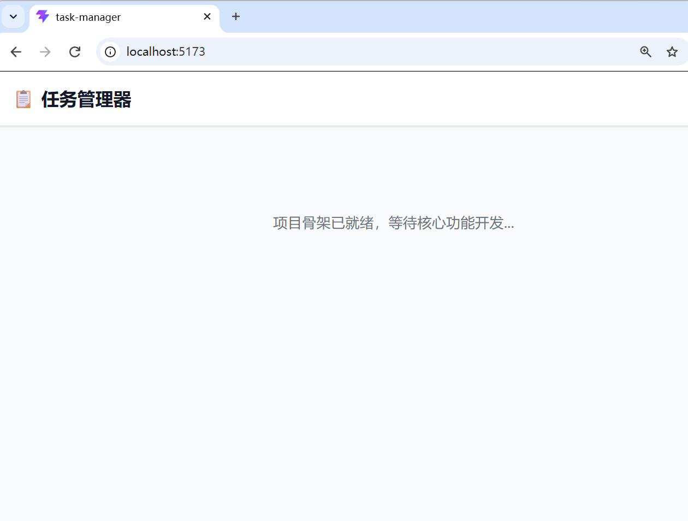
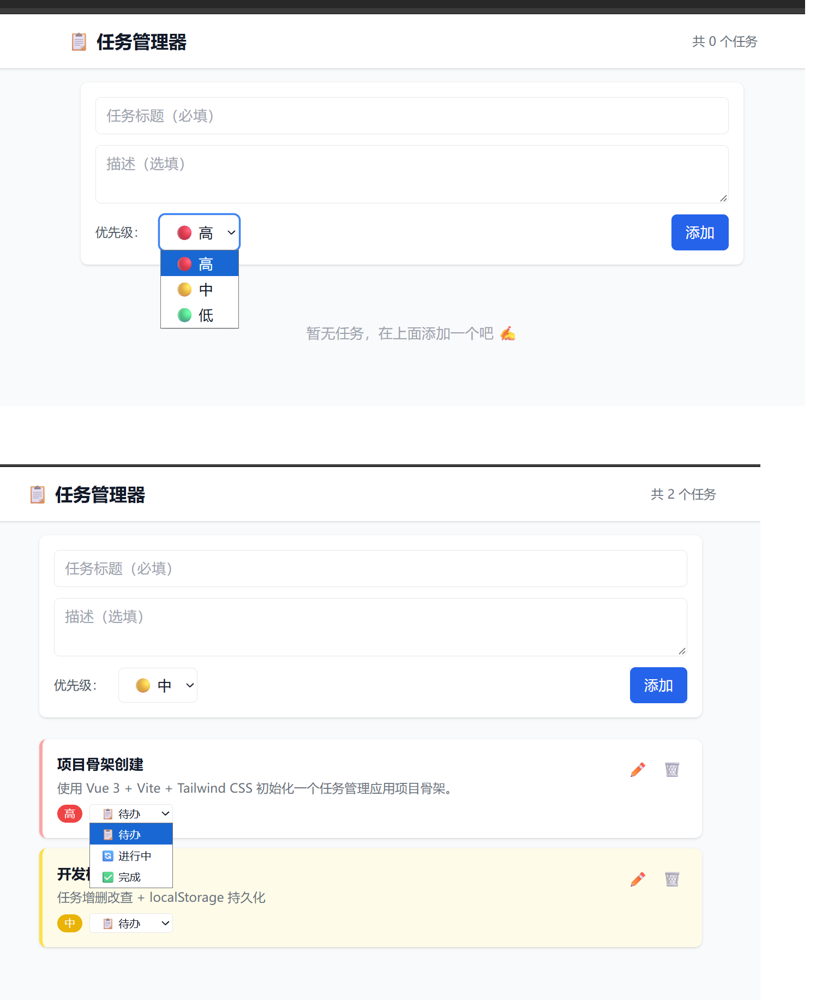
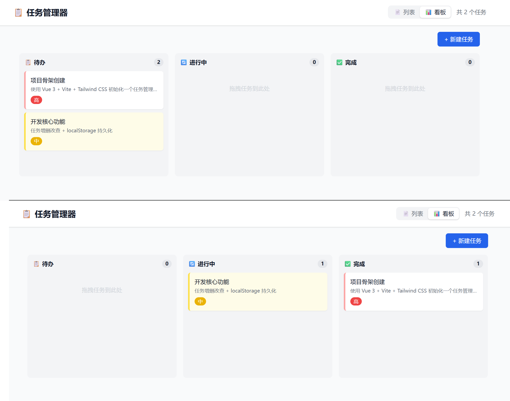
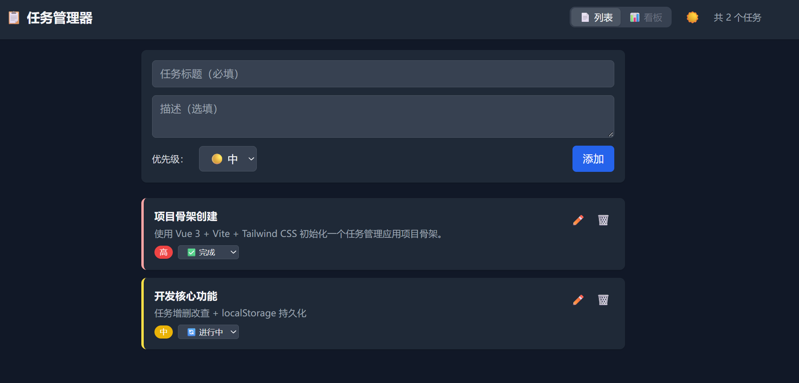

# 📋 任务管理器 — Agentic 开发实践

---

## 🛠 技术栈

| 层 | 选型 |
|---|------|
| 前端框架 | Vue 3 + TypeScript |
| 构建工具 | Vite 5 |
| 样式方案 | Tailwind CSS v3（含深色模式） |
| 数据持久化 | localStorage |
| 拖拽交互 | 原生 HTML5 Drag & Drop API |

---

## ✨ 功能一览

- ✅ 任务增删改查 — 标题必填、描述选填
- ✅ 三种状态切换 — 待办 / 进行中 / 完成
- ✅ 三档优先级 — 高（红）、中（黄）、低（绿）
- ✅ 看板视图 — 三列卡片，拖拽即改状态
- ✅ 深色模式 — 一键切换，刷新后保持
- ✅ 数据本地存储 — 全部存在浏览器 localStorage

---

## Agentic 开发流程

下面是本次课堂实践的「分轮迭代」全过程。每一轮：**写好提示词 → Agent 执行 → 浏览器验证 → Git commit**。

---

### 第 1 轮：项目骨架

**目标**  
初始化 Vue 3 + Vite + Tailwind CSS 的项目骨架，确定目录结构。

**提示词设计**

> 使用 Vue 3 + Vite + Tailwind CSS 初始化一个任务管理应用项目骨架。  
> 1. 用 Vite 创建 Vue 3 项目，开启 TypeScript  
> 2. 安装并配置 Tailwind CSS  
> 3. 确认项目的完整目录结构  

**成果**



> Agent 自动完成了 `npm create vite`、安装依赖、配置 Tailwind、创建 `types/` / `composables/` / `components/` 目录，并初始化 Git。

---

### 第 2 轮：任务增删改查 + localStorage

**目标**  
实现核心 CRUD 功能，任务数据存在浏览器 localStorage。

**提示词设计**

> 现在开发核心功能：任务的增删改查。  
> 1. 任务字段：标题（必填）、描述（选填）、优先级（高/中/低）、状态  
> 2. 优先级颜色区分：高=红、中=黄、低=绿  
> 3. 数据存入 localStorage，刷新不丢失  
> 4. 提供新建表单、任务列表、编辑和删除功能

**成果**



> Agent 创建了 `Task` 类型定义、`useTaskManager` 组合式函数（自动同步 localStorage）、`TaskForm` 表单组件和 `TaskList` 列表组件，刷新页面数据不丢失。

---

### 第 3 轮：看板视图 + 拖拽

**目标**  
用三列看板展示不同状态的任务，支持拖拽切换状态。

**提示词设计**

> 现在开发看板视图。  
> 1. 三列布局：待办 | 进行中 | 完成  
> 2. 每列显示卡片（标题 + 优先级颜色标签）  
> 3. 支持拖拽卡片到其他列，自动更改任务状态  
> 4. 使用 HTML5 Drag & Drop API，不引入额外库

**成果**



> Agent 实现了 `KanbanBoard` 组件，每列有拖入高亮和空状态提示，拖拽后自动更新任务状态。同时在 header 加了 📄/📊 视图切换按钮。

---

### 第 4 轮：深色模式

**目标**  
用户一键切换深色/浅色，偏好存 localStorage。

**提示词设计**

> 现在添加深色模式功能。  
> 1. 一键切换深色/浅色的按钮  
> 2. 利用 Tailwind CSS 的 dark 类  
> 3. 用户选择存入 localStorage，刷新后保持

**成果**



> 创建了 `useDarkMode` 组合式函数，首次访问跟随系统偏好，点击 header 右侧 ☀️/🌙 切换。所有组件（表单、卡片、看板）均已适配深色。

---

## 过程总结

| 轮次 | 功能 | 新增文件 |
|------|------|----------|
| 第 1 轮 | 项目骨架 | 15 个基础文件 |
| 第 2 轮 | CRUD + 持久化 | `types/task.ts` `composables/useTaskManager.ts` `components/TaskForm.vue` `components/TaskList.vue` |
| 第 3 轮 | 看板 + 拖拽 | `components/KanbanBoard.vue` |
| 第 4 轮 | 深色模式 | `composables/useDarkMode.ts` |

**一些心得：**
- 提示词的**精确度**很关键——要把技术选型、功能边界、验收标准一次性说清
- 每轮一个**可独立验收**的目标，Agent 不容易跑偏
- Plan → Execute → Verify → Commit 的四步循环保证了节奏感
- 遇到依赖版本冲突时（Vite 8 不兼容 Node 22.11），Agent 能自主降级到 Vite 5，体现了工程判断力

---

## 本地运行

```bash
git clone https://github.com/Bronya-19C/task-manager.git
cd task-manager
npm install
npm run dev
```

浏览器打开 `http://localhost:5173` 即可体验。
